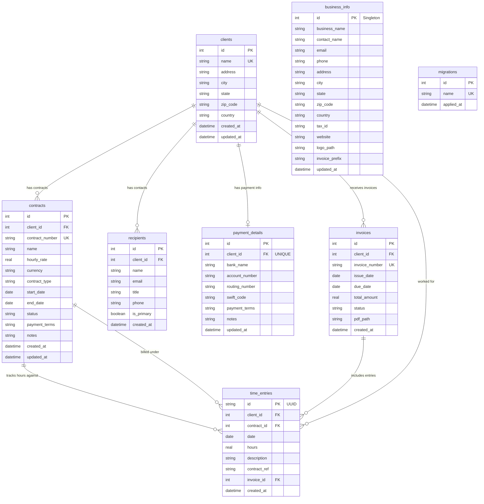

# Hours MCP - Time Tracking & Invoicing for Claude Desktop

A Go-based MCP (Model Context Protocol) server for Apple Silicon that enables comprehensive time tracking and professional invoice generation directly through Claude Desktop.

## Features

- **Contract-Based Billing**: Professional contract management with individual rates and terms per client engagement
- **Client Management**: Add, edit, and manage clients with complete address information
- **Time Tracking**: Log hours in 15-minute increments against specific contracts with detailed descriptions
- **Invoice Generation**: Create professional PDF invoices with business branding, client addresses, and contract details
- **Payment Details**: Store and manage banking information per client
- **Recipient Management**: Add, list, and remove multiple recipient contacts for each client
- **Business Information**: Configure company details for professional invoice headers
- **Natural Language Input**: Add hours using commands like "add 2 hours for contract CA-001 today"
- **SQLite Storage**: All data stored locally with automatic migrations in `~/.hours/db`

## Database Schema

The system uses SQLite with the following entity relationships:



## Key Database Relationships

- **Clients** are the core entity with complete address information (rates moved to contracts)
- **Contracts** define billing relationships with specific rates, terms, and duration per client engagement
- **Recipients** are contact persons at each client organization (many-to-one with clients)
- **Payment Details** store banking and payment terms information (one-to-one with clients)
- **Time Entries** track billable hours with UUID identifiers linked to both contracts and clients
- **Invoices** group time entries for billing with automatic numbering (many-to-one with clients)
- **Business Info** is a singleton containing your company information for invoice headers
- **Migrations** track database schema changes for safe upgrades

### Contract-Based Architecture
The system uses a professional contract-based billing model where:
- Each client can have multiple contracts with different rates and terms
- Time entries are logged against specific contracts, not just clients
- Invoices are generated per contract, allowing separate billing for different engagements
- Historical rate changes are preserved through contract versioning

## Installation

### Prerequisites
- Go 1.21 or later
- Claude Desktop app
- macOS on Apple Silicon (M1/M2/M3)

### Build and Install

```bash
# Clone the repository
git clone https://github.com/yourusername/hours-mcp
cd hours-mcp

# Download dependencies
make deps

# Build for Apple Silicon
make build

# Install to ~/.local/bin
make install
```

### Configure Claude Desktop

Add the MCP server to your Claude Desktop configuration:

1. Open Claude Desktop settings
2. Go to Developer → Edit Config
3. Add the following to the `mcpServers` section:

```json
{
  "mcpServers": {
    "hours": {
      "command": "/Users/YOUR_USERNAME/.local/bin/hours-mcp",
      "args": [],
      "env": {}
    }
  }
}
```

4. Restart Claude Desktop

## Usage Examples

### Client & Contract Management

```
"Add client Acme Corp with address 123 Business St, San Francisco, CA 94102"
"Edit client Acme Corp to update address to 456 New Street, Los Angeles, CA 90210"
"List all clients"
"Add contract AC-2025-001 for Acme Corp with rate $150/hour for Backend Development"
"List contracts for Acme Corp"
"Add recipient John Doe john@acmecorp.com for Acme Corp with title CTO"
"List recipients for Acme Corp"
"Remove recipient ID 5"
"Set payment details for Acme Corp: Bank of America, Net 30"
```

### Time Tracking

```
"Add 2 hours for contract AC-2025-001 today"
"Add 8 hours for contract AC-2025-001 this week"
"Add 4.5 hours for contract AC-2025-001 yesterday with description 'Backend API development'"
"List hours for this month"
"Show all hours for Acme Corp last week"
"Search time entries for contract AC-2025-001"
```

### Invoice Generation

```
"Create invoice for Acme Corp for this month"
"Make invoice for ClientX for last month"
"Create invoice for January 2025 for Acme Corp"
"List all pending invoices"
"Show invoice INV-202501-abc12345"
```

## Natural Language Time Entry

The MCP supports flexible natural language input:

- **Contract-based entries**: "Add 2 hours for contract CA-001 today"
- **Time periods**: "today", "yesterday", "this week", "last week", "this month"
- **Hour increments**: Supports 0.25 (15 min), 0.5 (30 min), 0.75 (45 min), etc.
- **Bulk entries**: "Add 8 hours for contract CA-001 this week" adds 8 hours to each weekday
- **Detailed descriptions**: All entries support rich descriptions for work performed

## Data Storage

All data is stored in SQLite at `~/.hours/db` with the following structure:
- Clients with complete address information
- Contracts with individual rates, terms, and status per client engagement
- Recipients for each client with management capabilities
- Payment details per client
- Time entries linked to both contracts and clients
- Generated invoices with PDF storage

## PDF Invoice Output

Invoices are generated as PDFs and saved to `~/Downloads/invoice_YYYY-MM-DD.pdf`

Each invoice includes:
- Business header with company information
- Client information and billing address
- Contract details (number, name, rate, terms)
- Itemized time entries with dates, descriptions, hours, and amounts
- Total hours and amount calculation
- Recipient contact information
- Payment details and banking information
- Due date (default: Net 30)

### Professional Features
- Single-contract billing for clean, focused invoices
- Automatic rate calculation from contract terms
- Complete audit trail with time entry UUIDs
- Professional formatting suitable for client delivery

## Development

```bash
# Run tests
make test

# Run locally for development
make run

# Clean build artifacts
make clean
```

## License

MIT